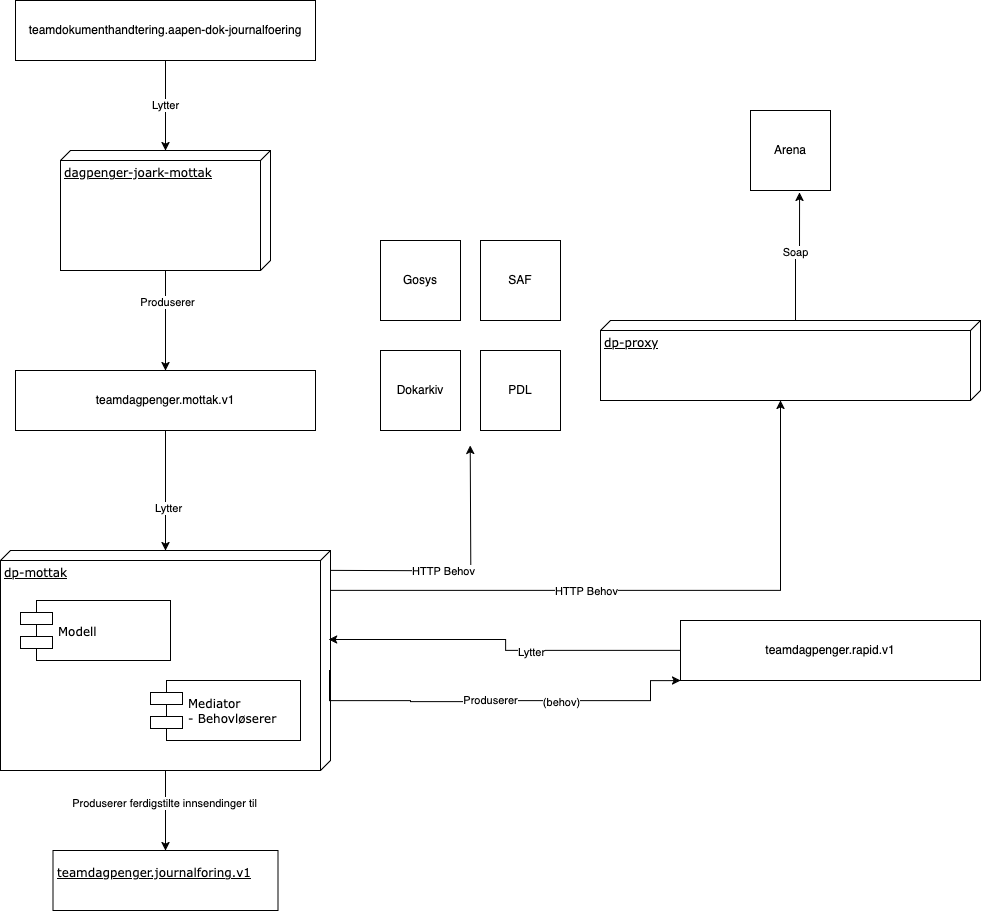
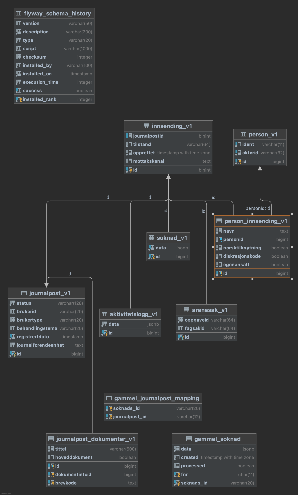

# dp-mottak

Ansvar for å håndterer [journalføringhendelser](https://confluence.adeo.no/pages/viewpage.action?pageId=432217859) på tema Dagpenger fra Joark (se også [dagpenger-joark-mottak](https://github.com/navikt/dagpenger-joark-mottak) ) og sørge for videre saksgang


## Komme i gang

Gradle brukes som byggverktøy og er bundlet inn.

```
./gradlew build
```

## Dokumentasjon

Skjemakoder og hvilke behandlende enhet (benk) en blir sendt til, se [tilstander](docs/arkitektur/tilstander)


## Arkitekturdiagram



## Databasediagram




## HOWTOS


### Finne journalposter for NYE søknader registrert innenfor en periode:

````postgresql

SELECT person.ident, journalpost.registrertdato, journalpostid FROM innsending_v1 AS innsending
LEFT JOIN person_innsending_v1 person_innsending on innsending.id = person_innsending.id
LEFT JOIN person_v1 person on person_innsending.personid = person.id
LEFT JOIN journalpost_v1 journalpost on innsending.id = journalpost.id
LEFT JOIN journalpost_dokumenter_v1 dokumenter on journalpost.id = dokumenter.id
WHERE journalpost.registrertdato BETWEEN '2021-05-05 13:07'::timestamp AND '2021-05-06 21:07'::timestamp 
AND dokumenter.brevkode in ('NAV 04-01.03', 'NAV 04-01.04');

````
ps- bytt ut datoene mellom BETWEEN med tidsperiode


### Skalere ned dp-mottak

Koble på riktig cluster

```bash
kubectx prod-gcp
kubens teamdagpenger
```

Skalere ned: 

```bash
kubectl scale deployment/dp-mottak --replicas=0
```

NB! Her vi alarmene si at dp-mottak er ned i #team-dagpenger-alerts
Du kan stoppe alerten (aka silence) i alertmanger

For å skalere opp igjen:

```bash
kubectl scale deployment/dp-mottak --replicas=2
```

# Henvendelser

Spørsmål knyttet til koden eller prosjektet kan rettes mot:

* André Roaldseth, andre.roaldseth@nav.no
* Eller en annen måte for omverden å kontakte teamet på

## For NAV-ansatte
Interne henvendelser kan sendes via Slack i kanalen #team-dagpenger-dev.
