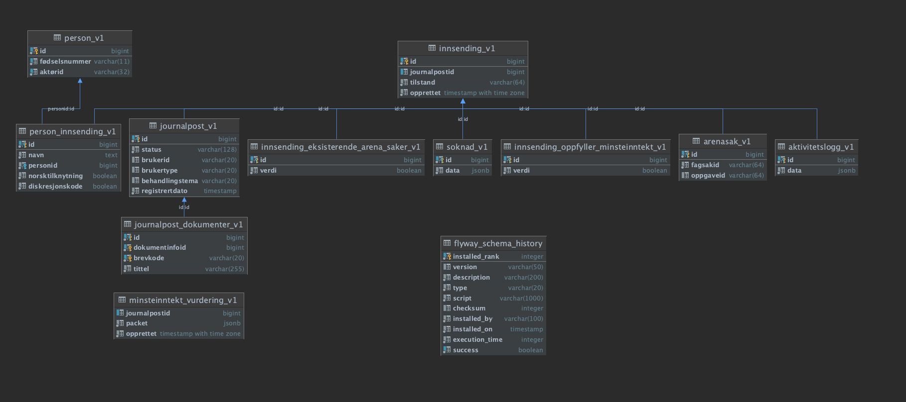

# dp-mottak

Ansvar for å håndtere hendelser på tema Dagpenger via Joark og sørge for videre saksgang


## Komme i gang

Gradle brukes som byggverktøy og er bundlet inn.

```
./gradlew build
```

## Dokumentasjon

Tilstander se [tilstander](docs/arkitektur/tilstander)
(Legg til plantuml plugin i IntelliJ hvis du vil se visuell representasjon)

Databasediagram


## HOWTOS


###Finne journalposter registrert innenfor en periode:

````postgresql

SELECT person.fødselsnummer, journalpost.registrertdato, journalpostid FROM innsending_v1 AS innsending
LEFT JOIN person_innsending_v1 person_innsending on innsending.id = person_innsending.id
LEFT JOIN person_v1 person on person_innsending.personid = person.id
LEFT JOIN journalpost_v1 journalpost on innsending.id = journalpost.id
WHERE journalpost.registrertdato BETWEEN '2021-05-05 13:07'::timestamp AND '2021-05-06 21:07'::timestamp;

````
ps- bytt ut datoene mellom BETWEEN med tidsperiode

### Replay av ferdigtilt_event i dev 


Forutsetninger:
- Du må være koblet på naisdevice
- Funker kun i dev-gcp
- Innsendingen må finnes, curl kallet feiler hvis ikke
- Innsendingen må være ferdigstilt, curl kallet feiler hvis ikke


```shell
curl -X PUT -u <bruker>:<passord> http://dp-mottak.dev.intern.no/internal/replay/<journalpostId>
```

Produserer ferdigstilt event. 

hente bruker:
```shell
kubectl get secret dp-mottak-basic-auth-secret -o yaml | grep BASIC_AUTH_USERNAME | awk '{print $2}' | base64 -d
```

hente passord:
```shell
kubectl get secret dp-mottak-basic-auth-secret -o yaml | grep BASIC_AUTH_PASSWORD | awk '{print $2}' | base64 -d
```

Eventuelt kan en installere pluginen 

```shell
kubectl view-secret dp-mottak-basic-auth-secret -a
```

# Henvendelser

Spørsmål knyttet til koden eller prosjektet kan rettes mot:

* André Roaldseth, andre.roaldseth@nav.no
* Eller en annen måte for omverden å kontakte teamet på

## For NAV-ansatte

Interne henvendelser kan sendes via Slack i kanalen #team-dagpenger-dev.
