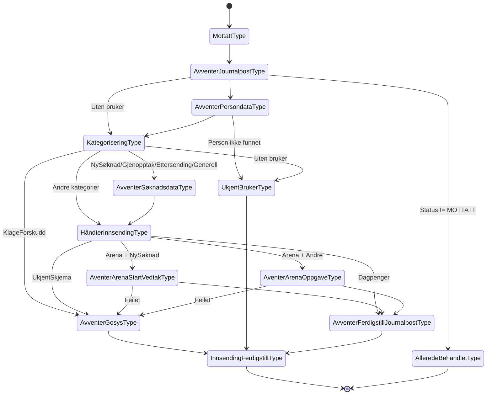
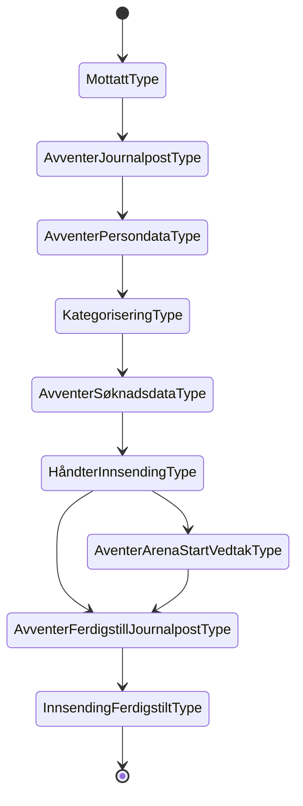
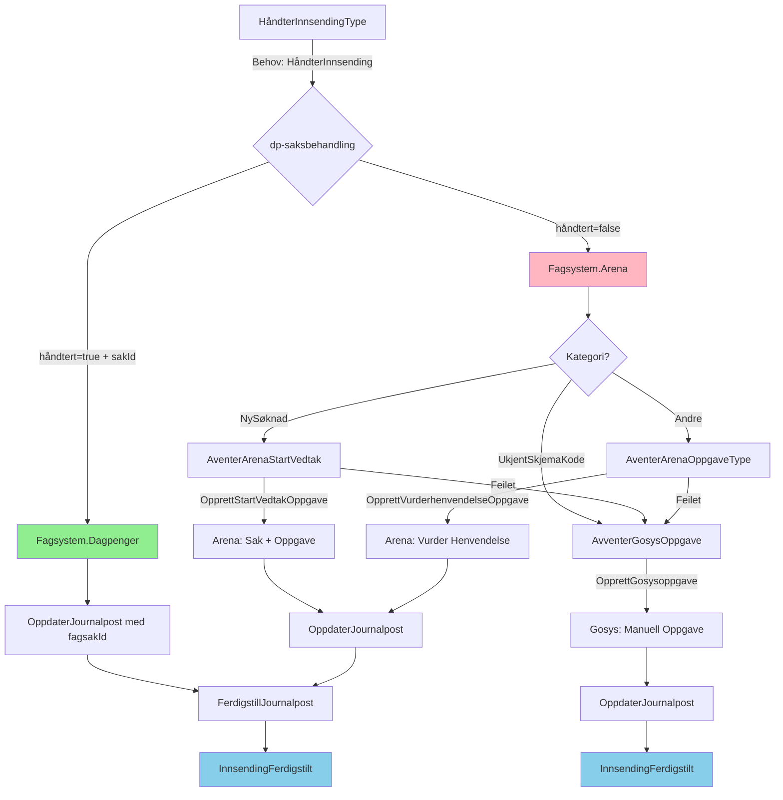

# dp-mottak - Applikasjonsdokumentasjon

## Oversikt

**dp-mottak** er en Kotlin-applikasjon som håndterer journalføringshendelser for dagpenger fra Joark (NAVs dokumentarkiv). Applikasjonen sørger for at innkommende dokumenter blir kategorisert, beriket med persondata, og rutet til riktig saksbehandlingssystem.

## Arkitektur

### Systemintegrasjoner

```
┌─────────────────────────────────────────┐
│  teamdokumenthandtering.aapen-dok-      │
│         journalfoering (Kafka)          │
└─────────────────────┬───────────────────┘
                      │ Lytter
                      ▼
┌─────────────────────────────────────────┐
│         dagpenger-joark-mottak          │
└─────────────────────┬───────────────────┘
                      │ Produserer
                      ▼
┌─────────────────────────────────────────┐
│      teamdagpenger.mottak.v1 (Kafka)    │
└─────────────────────┬───────────────────┘
                      │ Lytter
                      ▼
┌─────────────────────────────────────────┐
│              dp-mottak                  │
│  ┌────────┐  ┌──────────────────────┐  │
│  │ Modell │  │      Mediator        │  │
│  │        │  │   - Behovløsere      │  │
│  └────────┘  └──────────────────────┘  │
└─────────────────────┬───────────────────┘
                      │ Produserer
                      ▼
┌─────────────────────────────────────────┐
│   teamdagpenger.journalforing.v1        │
│              (Kafka)                    │
└─────────────────────────────────────────┘
```

### Eksterne Tjenester

| Tjeneste | Formål |
|----------|--------|
| **SAF** (Sak og Arkiv Fasade) | Henter journalpostdata og søknadsdata |
| **PDL** (Persondataløsningen) | Henter personinformasjon |
| **Dokarkiv** | Oppdaterer og ferdigstiller journalposter |
| **Arena** | Oppretter saker og oppgaver i Arena (via dp-proxy) |
| **Gosys** | Oppretter oppgaver i Gosys |

## Modulstruktur

```
dp-mottak/
├── modell/          # Domenemodell (Innsending, tilstander, meldinger)
├── mediator/        # Applikasjonslogikk, behovløsere, API
└── openapi/         # API-spesifikasjoner
```

## Domenemodell

### Innsending (State Machine)

Kjernen i applikasjonen er `Innsending`-klassen som implementerer et **State Pattern** for å håndtere livssyklusen til en journalpost.

### Tilstander



### Tilstandsbeskrivelser

| Tilstand | Beskrivelse |
|----------|-------------|
| `MottattType` | Initiell tilstand når journalpost mottas fra Joark |
| `AvventerJournalpostType` | Venter på journalpostdata fra SAF |
| `AvventerPersondataType` | Venter på persondata fra PDL |
| `KategoriseringType` | Kategoriserer journalposten basert på skjemakode |
| `AvventerSøknadsdataType` | Venter på søknadsdata for søknader/gjenopptak |
| `HåndterInnsendingType` | Beslutter om innsending skal til Arena eller dp-saksbehandling |
| `AventerArenaStartVedtakType` | Oppretter sak og oppgave i Arena for nye søknader |
| `AventerArenaOppgaveType` | Oppretter vurder-henvendelse oppgave i Arena |
| `AvventerGosysType` | Oppretter oppgave i Gosys (fallback) |
| `AvventerFerdigstillJournalpostType` | Ferdigstiller journalpost i Dokarkiv |
| `InnsendingFerdigstiltType` | Sluttilstand - innsending er ferdig behandlet |
| `AlleredeBehandletType` | Journalpost har annen status enn MOTTATT |
| `UkjentBrukerType` | Bruker ikke funnet eller mangler på journalpost |

## Kategorisering av Journalposter

Journalposter kategoriseres basert på brevkode (skjemakode):

| Kategori | Brevkoder | Beskrivelse |
|----------|-----------|-------------|
| **NySøknad** | NAV 04-01.03, NAV 04-01.04 | Ny dagpengesøknad (ordinær/permittert) |
| **Gjenopptak** | NAV 04-16.03, NAV 04-16.04 | Gjenopptak av dagpenger |
| **Ettersending** | NAVe 04-01.03, NAVe 04-01.04, NAVe 04-16.03, NAVe 04-16.04 | Ettersending til søknad |
| **Utdanning** | NAV 04-06.05 | Søknad om utdanning med dagpenger |
| **Etablering** | NAV 04-06.08 | Søknad om dagpenger under etablering |
| **Klage** | NAV 90-00.08, NAV 90-00.08 K | Klage på vedtak |
| **Anke** | NAV 90-00.08 A | Anke på vedtak |
| **KlageForskudd** | NAV 90-00.08 (behandlingstema ab0451) | Klage på forskudd |
| **Generell** | GENERELL_INNSENDING | Generell innsending |
| **UkjentSkjemaKode** | Andre | Ukjent skjemakode |
| **UtenBruker** | - | Journalpost uten registrert bruker |

## Ruting til Behandlende Enhet

Basert på kategorisering og søknadsdata rutes journalposter til ulike enheter:

| Enhet | Kriterier |
|-------|-----------|
| **4450** | Standard dagpengebenk |
| **4465** | Permittering med EØS-bostedsland |
| **4470** | EØS-arbeidsforhold / Utland |
| **4457** | Konkurs |
| **4454** | Fiskeforedling |
| **4270** | Anke |
| **4153** | Klage - Forskudd |
| **2103** | Diskresjonskode (fortrolig adresse) |
| **4483** | Egen ansatt |

## Hendelsesflyt

### Hovedflyt for Ny Søknad

```
1. JoarkHendelse mottas
   ↓
2. Behov: Journalpost → SAF returnerer journalpostdata
   ↓
3. Behov: Persondata → PDL returnerer personinfo
   ↓
4. Kategorisering: NySøknad identifisert
   ↓
5. Behov: Søknadsdata → SAF returnerer søknadsfakta
   ↓
6. Behov: HåndterInnsending → Beslutter fagsystem
   ↓
7a. Arena: Behov OpprettStartVedtakOppgave
    ↓
    Behov: OppdaterJournalpost → Dokarkiv
    ↓
7b. Dagpenger: Behov OppdaterJournalpost → Dokarkiv
   ↓
8. Behov: FerdigstillJournalpost → Dokarkiv
   ↓
9. Event: innsending_ferdigstilt → Kafka
```

## Behovløsere

Applikasjonen bruker behovsmønsteret for asynkron kommunikasjon:

| Behovtype | Løser | Formål |
|-----------|-------|--------|
| `Journalpost` | JournalpostBehovLøser | Henter journalpostdata fra SAF |
| `Persondata` | PersondataBehovLøser | Henter persondata fra PDL |
| `Søknadsdata` | SøknadsdataBehovLøser | Henter søknadsdata fra SAF |
| `HåndterInnsending` | (ekstern) | Beslutter fagsystem (Arena/Dagpenger) |
| `OpprettStartVedtakOppgave` | ArenaBehovLøser | Oppretter sak/oppgave i Arena |
| `OpprettVurderhenvendelseOppgave` | ArenaBehovLøser | Oppretter vurder-henvendelse i Arena |
| `OpprettGosysoppgave` | OpprettGosysOppgaveLøser | Oppretter oppgave i Gosys |
| `OppdaterJournalpost` | OppdaterJournalpostBehovLøser | Oppdaterer journalpost i Dokarkiv |
| `FerdigstillJournalpost` | FerdigstillJournalpostBehovLøser | Ferdigstiller journalpost i Dokarkiv |

## Kafka Topics

| Topic | Retning | Formål |
|-------|---------|--------|
| `teamdagpenger.mottak.v1` | Inn | Mottar journalføringshendelser |
| `teamdagpenger.rapid.v1` | Inn/Ut | Behov og svar (Rapids & Rivers) |
| `teamdagpenger.journalforing.v1` | Ut | Publiserer ferdigstilte innsendinger |

## Events

### innsending_mottatt
Publiseres når søknadsdata er hentet og innsending forlater `AvventerSøknadsdataType`.

### innsending_ferdigstilt
Publiseres når innsending når `InnsendingFerdigstiltType`. Inneholder:
- journalpostId
- fødselsnummer
- aktørId
- skjemaKode
- tittel
- type (kategori)
- datoRegistrert
- fagsakId (hvis opprettet)
- søknadsData (hvis tilgjengelig)

## Database

Applikasjonen bruker PostgreSQL for persistering av innsendingstilstand.

## Teknisk Stack

- **Språk:** Kotlin
- **Byggverktøy:** Gradle
- **Rammeverk:** Ktor
- **Meldingshåndtering:** Rapids & Rivers
- **Database:** PostgreSQL
- **Metrics:** Micrometer/Prometheus
- **Deploy:** NAIS (Kubernetes)

## Mottakskanaler

Følgende mottakskanaler **støttes ikke**:
- EESSI
- NAV_NO_CHAT

## Eksempel: Flyt for NAV 04-01.03 (Ny Søknad)



**Kategorisert som:** `NySøknad`  
**Behandlende enhet:** `4450` (standard) eller spesialenhet basert på søknadsdata

---

## Fagsystem-ruting: Arena vs dp-saksbehandling

### Oversikt

dp-mottak **beslutter ikke selv** hvilket fagsystem som skal håndtere innsendingen. Den sender et behov (`HåndterInnsending`) til en ekstern tjeneste (dp-saksbehandling) som beslutter om innsendingen kan håndteres i det nye dagpenger-systemet eller om den skal til Arena.

### Behovsflyt

```
┌─────────────────────────────────────────────────────────────────┐
│                       dp-mottak                                 │
│                                                                 │
│  HåndterInnsendingType                                          │
│       │                                                         │
│       ▼                                                         │
│  Sender behov: HåndterInnsending                               │
│  med data:                                                      │
│    - kategori (NY_SØKNAD, GJENOPPTAK, etc.)                    │
│    - fødselsnummer                                              │
│    - journalpostId                                              │
│    - registrertDato                                             │
│    - skjemaKode                                                 │
│    - søknadId (hvis tilgjengelig)                              │
└──────────────────────────┬──────────────────────────────────────┘
                           │
                           ▼
┌─────────────────────────────────────────────────────────────────┐
│                   dp-saksbehandling (ekstern)                   │
│                                                                 │
│  Evaluerer om innsendingen kan håndteres:                      │
│  - Støttet kategori?                                            │
│  - Feature toggles?                                             │
│  - Andre forretningsregler?                                     │
│                                                                 │
│  Returnerer løsning:                                            │
│    { "håndtert": true/false, "sakId": "<uuid>" }               │
└──────────────────────────┬──────────────────────────────────────┘
                           │
                           ▼
┌─────────────────────────────────────────────────────────────────┐
│                       dp-mottak                                 │
│                                                                 │
│  Mottar HåndtertInnsending med:                                │
│    - håndtert = true  → Fagsystem.Dagpenger(sakId)             │
│    - håndtert = false → Fagsystem.Arena                        │
└─────────────────────────────────────────────────────────────────┘
```

### Beslutningslogikk i dp-mottak

Når dp-mottak mottar svaret fra dp-saksbehandling, bestemmes videre flyt:

```kotlin
when (håndtertInnsending.fagsystem) {
    is Fagsystem.Dagpenger -> {
        // Sak opprettet i dp-saksbehandling
        // → Oppdater journalpost med fagsakId
        // → Ferdigstill journalpost
    }
    is Fagsystem.Arena -> {
        // dp-saksbehandling kan ikke håndtere
        when (kategorisertJournalpost) {
            is NySøknad → AventerArenaStartVedtak  // Opprett sak+oppgave i Arena
            is UkjentSkjemaKode → AvventerGosysOppgave  // Gosys fallback
            else → AventerArenaOppgaveType  // Vurder henvendelse oppgave
        }
    }
}
```

### Flytdiagram: Fagsystem-beslutning



### Arena-oppgavetyper

| Oppgavetype | Når | Beskrivelse |
|-------------|-----|-------------|
| **OpprettStartVedtakOppgave** | NySøknad til Arena | Oppretter sak og "Start Vedtak"-oppgave i Arena |
| **OpprettVurderhenvendelseOppgave** | Gjenopptak/Ettersending/etc til Arena | Oppretter "Vurder Henvendelse"-oppgave i Arena |
| **OpprettGosysoppgave** | Fallback | Oppretter manuell oppgave i Gosys |

### Eksempler

#### Eksempel 1: Ny søknad håndtert av dp-saksbehandling
```
1. JoarkHendelse (NAV 04-01.03)
2. → Journalpost hentet
3. → Persondata hentet  
4. → Søknadsdata hentet
5. → HåndterInnsending behov sendt
6. ← Svar: { "håndtert": true, "sakId": "550e8400-e29b-..." }
7. → OppdaterJournalpost (med fagsakId)
8. → FerdigstillJournalpost
9. → Event: innsending_ferdigstilt (til dp-saksbehandling)
```

#### Eksempel 2: Ny søknad til Arena
```
1. JoarkHendelse (NAV 04-01.03)
2. → Journalpost hentet
3. → Persondata hentet
4. → Søknadsdata hentet
5. → HåndterInnsending behov sendt
6. ← Svar: { "håndtert": false }
7. → OpprettStartVedtakOppgave (Arena)
8. ← Arena svar med fagsakId + oppgaveId
9. → OppdaterJournalpost (med Arena fagsakId)
10. → FerdigstillJournalpost
11. → Event: innsending_ferdigstilt
```

#### Eksempel 3: Gjenopptak til Arena
```
1. JoarkHendelse (NAV 04-16.03)
2. → Journalpost hentet
3. → Persondata hentet
4. → Søknadsdata hentet
5. → HåndterInnsending behov sendt
6. ← Svar: { "håndtert": false }
7. → OpprettVurderhenvendelseOppgave (Arena)
8. ← Arena svar
9. → OppdaterJournalpost
10. → FerdigstillJournalpost
```

#### Eksempel 4: Arena feiler → Gosys fallback
```
1. JoarkHendelse (NAV 04-01.03)
2. → Journalpost hentet
3. → Persondata hentet
4. → Søknadsdata hentet
5. → HåndterInnsending behov sendt
6. ← Svar: { "håndtert": false }
7. → OpprettStartVedtakOppgave (Arena)
8. ← Arena FEILET
9. → OpprettGosysoppgave (fallback)
10. → OppdaterJournalpost
11. → InnsendingFerdigstilt
```

### Oppsummering per kategori

| Kategori | Henter søknadsdata? | Spør dp-saksbehandling? | Hvis Arena |
|----------|---------------------|-------------------------|------------|
| **NySøknad** | Ja | Ja | Arena: Start Vedtak |
| **Gjenopptak** | Ja | Ja | Arena: Vurder Henvendelse |
| **Ettersending** | Ja | Ja | Arena: Vurder Henvendelse |
| **Generell** | Ja | Ja | Arena: Vurder Henvendelse |
| **Utdanning** | Nei | Ja | Arena: Vurder Henvendelse |
| **Etablering** | Nei | Ja | Arena: Vurder Henvendelse |
| **Klage** | Nei | Ja | Arena: Vurder Henvendelse |
| **Anke** | Nei | Ja | Arena: Vurder Henvendelse |
| **UkjentSkjemaKode** | Nei | Ja | Gosys |
| **KlageForskudd** | Nei | **Nei** (direkte til Gosys) | Gosys |
| **UtenBruker** | Nei | **Nei** (direkte til Gosys) | Gosys |

**Merk:** Alle kategorier unntatt KlageForskudd og UtenBruker spør dp-saksbehandling først. Det er dp-saksbehandling som beslutter om den kan håndtere saken eller om den skal til Arena.

### Event: innsending_ferdigstilt

Når innsending er ferdigstilt, publiseres et event med flagget `bruk-dp-behandling: true`. Dette signaliserer til downstream-systemer (som dp-behandling) at de kan plukke opp saken.

```json
{
  "@event_name": "innsending_ferdigstilt",
  "bruk-dp-behandling": true,
  "journalpostId": "12345678",
  "fødselsnummer": "12345678901",
  "fagsakId": "550e8400-e29b-41d4-a716-446655440000",
  "type": "NY_SØKNAD",
  ...
}
```

---

## Kontakt

- Slack: #team-dagpenger-dev
- Epost: team-dagpenger@nav.no
