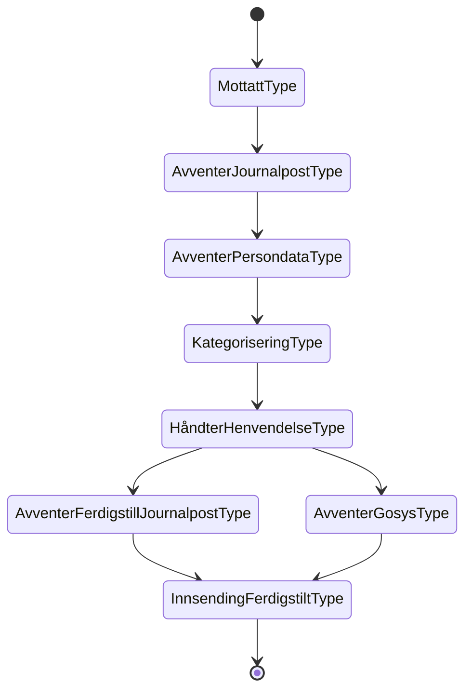

## Innløpet – flyt for brevkode Ukjente brevkoder
Kategorisert som: `UkjentSkjemaKode`, Behandlende enhet: `4450`

```mermaid
   stateDiagram
   [*]-->MottattType
   	MottattType --> AvventerJournalpostType
	AvventerJournalpostType --> AvventerPersondataType
	AvventerPersondataType --> KategoriseringType
	KategoriseringType --> HåndterHenvendelseType
    HåndterHenvendelseType --> AvventerGosysType
    HåndterHenvendelseType --> AvventerFerdigstillJournalpostType
    AvventerFerdigstillJournalpostType --> InnsendingFerdigstiltType
	AvventerGosysType --> InnsendingFerdigstiltType
   InnsendingFerdigstiltType--> [*]    
```